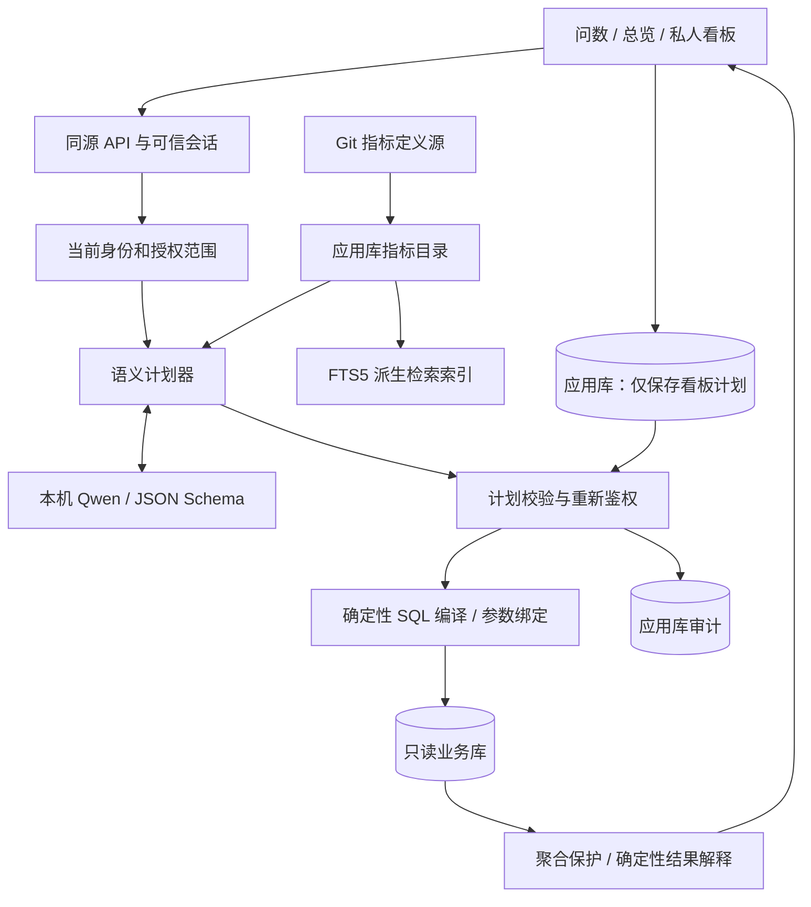

# 架构与设计决策

本地演示交付，不代表已经获得企业生产数据访问许可。面向真实业务沟通，使用真实模型、真实关系查询、明确范围和全合成数据。

## 查询流程

模型节点没有到数据库的执行通道。总览与已保存看板直接进入确定性查询路径，省去模型推理。

1. 浏览器以 HttpOnly、SameSite=Strict 的不透明会话访问同源 API。
2. 后端从应用库取得身份与完整授权记录，客户端不能指定角色。
3. 能力边界检查拒绝已知未开放条件，避免模型静默丢弃筛选条件。
4. 按权限选取指标目录与组织元数据，连同当前演示日期和同身份的上一轮计划发给本地 LM Studio。
5. Qwen3.8-27B-MLX 返回 JSON 查询计划；Pydantic 严格验证枚举、字段、日期和限额。结构错误最多重试一次。
6. 检查明细意图与计划类型一致；推理完成后重新读取最新权限，防止推理期间撤权。
7. 确定性编译器将受限计划编译为 SQL。人员范围由服务端绑定；所有聚合前先限制人员。
8. SQLite 只读连接、query_only、读取表/函数 authorizer、两秒执行期限共同约束执行。
9. 输出经过汇总保护与格式处理；数值和摘要由程序计算，模型不负责再算数字。
10. 浏览器展示图表、表格、时间、口径、版本和查询过程。看板保存计划，再次打开时重新鉴权执行。

业务库与模型之间没有通用 execute_sql 工具。模型看不到人员明细、薪酬值、数据库凭证或应用会话。

## 技术选择

| 层 | 本次实现 | 原因与生产演进 |
|---|---|---|
| 前端 | React 19 + Vinext/Vite，Base UI/shadcn，按需加载 Recharts | 保留 Sites 生成工程；本地 Node 服务可连接本机模型；正式采用前应评估 beta 框架升级策略或迁移稳定框架 |
| API | FastAPI + Pydantic + HTTPX | 类型契约清晰；模型异步请求；查询与常规接口可继续服务 |
| 业务库 | 独立 SQLite 文件，24 张规范化关系表 | 零外部依赖、方便会议演示；生产优先复用现有仓库或 PostgreSQL 分析库 |
| 应用库 | 独立 SQLite WAL 文件 | 身份、会话、指标、看板、查询计划和审计与业务数据分离 |
| 指标定义 | Git 中 JSON 源文件 | 可审核、版本化；指标含名称、定义、来源、维度、责任人、分级和小样本规则 |
| 指标检索 | SQLite FTS5 trigram + 中文短词精确匹配 | 当前只有17个指标，无须向量库；检索只能发现已授权指标 |
| 模型 | 本机 LM Studio，模型别名 hr-qwen | 实测安装模型为 qwen3.8-27b-mlx，8192上下文，单路推理 |
| 性能 | 看板跳过模型、查询范围先收窄、索引、行数及时间限额 | 演示不使用跨用户结果缓存，降低撤权与共享缓存风险 |

## 口径存储的职责

- `semantic/catalog.json` 是经 Git 审核的定义源，包含可查指标与允许分组。
- `app.sqlite.metrics` 是发布到应用库的指标目录；`metric_search` 是派生全文索引。
- 查询编译的实现与定义在同一 Git 版本交付。修改公式、适用范围或含义需要变更版本和回归评测。
- Markdown 用来解释业务背景、架构和决策，不作为运行时授权源。
- 未来加入大量制度文档时，再引入带文档权限、版本和来源的全文或混合检索。向量相似度不得决定查询权限、连接路径和计算公式。

当前指标规模小，精确检索与类型计划便于检查；“指标目录存在”不意味着系统支持任意维度、公式或问题。

## 参考方案与取舍（2026-09-12）

本次查看的是官方文档与仓库，没有把第三方整套平台嵌入本项目，也未对其做完整安全审计。

- [WrenAI 官方仓库](https://github.com/Canner/WrenAI)：借鉴可版本化语义上下文、计划校验和评测。仓库当前主线与旧版聊天产品已经分开，旧产品位于 legacy/v1；开源与商业治理能力有区分。不能假定复制开源版即可获得企业权限控制。
- [Cube 数据访问策略](https://docs.cube.dev/docs/data-modeling/data-access-policies)：借鉴统一语义服务中绑定安全上下文、行与成员级访问策略。当前项目专门实现 HR 的管理关系和指标权限，避免引入额外服务来完成小范围演示。
- [MetricFlow 官方仓库](https://github.com/dbt-labs/metricflow)：借鉴 metrics as code 与统一 SQL 编译。若企业已经使用 dbt，正式落地应优先接入已有指标资产，避免重建相同公式。
- [LM Studio 结构化输出](https://lmstudio.ai/docs/developer/openai-compat/structured-output)：实际使用 JSON Schema 响应约束。该 MLX 组合有时将整个结构化 JSON 放在 reasoning_content 中，适配器只解析通过 Schema 的 JSON，不向用户显示原始推理文本。
- [OWASP 授权](https://cheatsheetseries.owasp.org/cheatsheets/Authorization_Cheat_Sheet.html)：默认拒绝、逐请求鉴权。前端控制与模型判断均不承担最终授权。
- [PostgreSQL RLS](https://www.postgresql.org/docs/current/ddl-rowsecurity.html)：生产数据库层隔离的迁移依据；需要验证执行角色、表所有者、BYPASSRLS 和视图权限。

## 明确未实现的生产能力

企业 SSO/SCIM、外部授权源同步、PostgreSQL RLS、真实节假日日历、半日请假、跨午夜班次、跨地域法规、实时数据接入、团队共享与订阅、大量异构数据库、任意自由 SQL、长期分布式任务、不可篡改集中审计、灾备和高可用。当前 HR_MODE 非 demo 时启动失败，不能把演示身份切换直接用于生产。

## 执行可观测性

当前Agent通过ContextVar传播运行ID，在线程执行SQL时保留同一上下文。每个实际节点开始/结束保存输入输出和耗时到独立应用库debug_runs，前端每2.5秒读取运行状态。失败/修复/拒绝保留真实路径；不以预设流程冒充实际执行。模型输出与确定性规则校正分别显示。所有调试读取重新校验身份和当前授权指纹；薪酬原始聚合不入记录。详细节点、接口和生产接入边界见 [DEBUGGING.md](DEBUGGING.md)。

数据库与口径页从SQLite PRAGMA与实际SQL编译结果生成；静态文档由同一inventory函数导出，避免另外手抄一套字段和公式。
