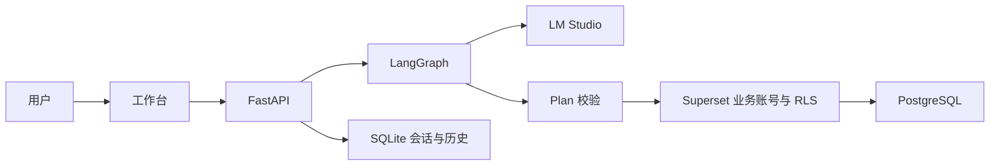
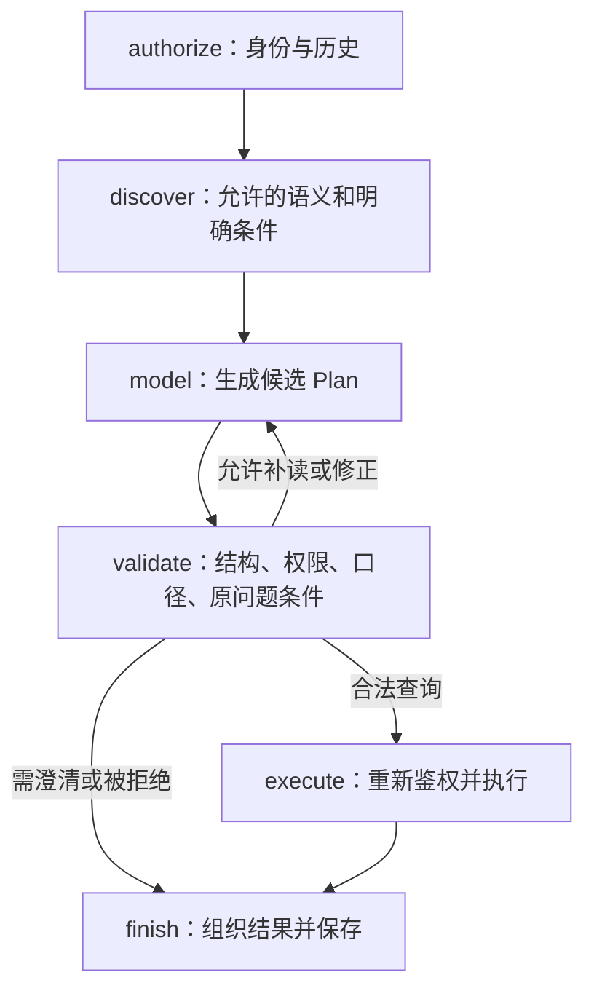

# 项目代码目录与整体逻辑

本文只描述当前可运行的系统。仓库不再并列保留旧工作台或阶段版本目录；Superset/OpenFGA 是同一应用的两个可选适配器。
代码历史由 Git 保存；阅读当前文件即可理解当前行为。默认执行链为 **LangGraph → Superset → PostgreSQL**；OpenFGA 链路和同步协议见 [方案设计](OPENFGA_DESIGN.md)。

## 1. 从哪里开始读

```text
Smart_hr_database/
├── README.md                     # 唯一启动和文档入口
├── app/
│   ├── page.tsx                  # 首页：智能问数工作台
│   ├── debug/page.tsx            # 独立节点调试页
│   ├── api/[...path]/route.ts     # 同源代理；会话、CSRF 与安全响应头
│   └── globals.css               # 基础排版
├── components/workspace/         # 当前界面全部业务组件
├── backend/hr/
│   ├── api.py                    # FastAPI 生命周期、中间件、路由装配
│   ├── routes.py                 # 15 个业务接口
│   ├── config.py                 # 数据目录和模型配置
│   ├── model.py                  # 模型状态与单并发闸门
│   ├── graph.py                  # LangGraph 六节点问数流程
│   ├── grounding.py              # 明确时间、学历、部门等条件绑定
│   ├── schema.py                 # 26 字段、15 指标与严格 Plan
│   ├── registry.py               # 别名、说明、权限内渐进披露
│   ├── auth.py                   # 会话、授权入口、指纹和离线策略
│   ├── query.py                  # 统一校验与执行分派；离线 SQL 编译器
│   ├── superset_source.py        # 业务账号、受限快照与上游错误处理
│   ├── superset_query.py         # PostgreSQL 表达式与 Chart Data 请求
│   ├── fga_client.py             # OpenFGA HTTP 与批量检查完整性
│   ├── openfga_source.py         # 主体、发布快照、权限、PG只读上下文
│   ├── openfga_query.py          # 复用校验与结果格式的 PostgreSQL 编译器
│   ├── service.py                # 摘要、核验、下钻、历史
│   ├── reference.py              # 独立 Python 参考计算与 BFS
│   └── store.py                  # 确定性样本、SQLite 会话和历史
├── integrations/superset/
│   ├── services.sh / compose.yaml # 本机平台生命周期
│   ├── prepare.py               # 本机密钥，已有密钥不覆盖
│   ├── init-postgres.sh          # 首次创建平台元数据库
│   ├── Dockerfile / superset_config.py # 固定镜像与平台配置
│   ├── export.py                # 300 人、26 字段及策略导出
│   ├── run.py                   # 宿主机 setup/status/verify-storage 入口
│   ├── setup.py / schema.sql    # 数据库、递归关系、用户、角色、RLS
│   ├── learning.py / learning_inspect.py # 手工课堂材料、只读 ID 盘点与 Agent 绑定
│   ├── initialization_guard.py # 学习保护；兼容容器与宿主机 UID 不同
│   ├── reset_learning.py        # 备份后清空本项目课堂对象；不是日常启动入口
│   ├── verify_storage.py        # 数据与物理权限核验
│   ├── status.py                # 只读配置盘点
│   └── probe.py                 # 撤权回归及恢复
├── integrations/openfga/        # 模型DSL、官方转换器、独立服务、同步、真实回归
├── evaluation/                  # cases/plans/golden/paraphrases，当前验收资料
├── tests/                       # 当前业务与迁移回归
├── scripts/                     # 启动、验收、文档校验、状态迁移与打包
├── docs/                        # 当前说明；HANDS_ON 为实操路线，LEARNING_LOG 记录学习进度
├── .github/workflows/           # 代码检查、真实 Superset 验证、打包
├── data/                        # 本机数据，Git 忽略
└── reports/                     # 本次验证生成的证据，Git 忽略
```

推荐顺序：`schema.py` → `graph.py` → `auth.py` → `superset_source.py` → `superset_query.py` → `service.py` → 前端 `workspace.tsx`。入口文件只做装配，不复制查询和权限规则。

## 2. 数据和进程如何连接

| 进程 | 地址 | 负责什么 |
|---|---|---|
| React + Vinext/Vite | 127.0.0.1:3000 | `/` 问数、`/debug` 调试、同源 `/api/*` 代理 |
| FastAPI | 127.0.0.1:8000 | 统一 API、Agent、会话与应用权限 |
| LM Studio | 127.0.0.1:1234 | 输出受限 JSON Plan；默认标识 `hr-qwen` |
| Superset 6.1.0 | 127.0.0.1:8088 | 业务用户身份、数据集角色、RLS、查询编译 |
| PostgreSQL 17.11 | 宿主机 55432；容器 postgres:5432 | 业务宽表、授权关系、筛选和统计 |



| 内容 | 唯一来源 |
|---|---|
| 在线业务数据和策略 | PostgreSQL `hr_v2`；Superset 模式禁止从离线文件放行 |
| 字段、口径、别名 | `schema.py`、`registry.py`，随代码版本管理；无向量库 |
| 会话、历史、审计 | `data/sessions.sqlite` |
| 合成基线/导入来源 | `data/people.sqlite`；固定种子 `20260911`、快照日 `2026-09-11` |
| Superset 账号、角色、RLS、数据集 | Superset 元数据库 |
| Agent 用户映射与本机凭据 | `integrations/superset/.local/application/`，凭据仅服务端读取 |

`HR_QUERY_BACKEND=superset` 是默认值；`sqlite` 是显式离线验证模式。两者使用同一个 Plan、同一套指标和同一界面，没有第二套产品代码。上游故障绝不自动降级到离线数据。

已有 PostgreSQL 的 `hr_v2`、`v2_*` schema/账号、Superset 的 `V2_*` 对象名以及数据版本字符串是持久化标识，继续复用以保留权限和历史指纹；它们不表示仓库中存在第二套实现。目录名称与公开应用接口不含阶段版本号。

## 3. 一次提问的完整执行流程

以王灏提问“其中可信与 AI 实验室有多少在职员工”为例，前提是已经有一轮成功查询作为追问上下文。

### 3.1 浏览器只提交问题和上一轮 ID

[workspace.tsx](../components/workspace/workspace.tsx) 提交 `POST /api/chat`，核心内容为 `question` 和可选 `previous_id`。浏览器不提交 Superset 密码、数据库连接或授权人员列表。

[API 代理](../app/api/[...path]/route.ts) 把请求转发给 FastAPI，并保留会话 cookie 与 CSRF 请求头。当前应用的 [routes.checked()](../backend/hr/routes.py) 读取会话主体，再校验 CSRF。

### 3.2 LangGraph 的六个实际节点

[graph.py](../backend/hr/graph.py) 底部 `_builder` 定义图的拓扑，`GRAPH` 是编译后的图。`answer()` 是对外入口。



| 节点 / 函数 | 主要输入 | 主要输出与约束 |
|---|---|---|
| `authorize()` | 服务端 principal、上一轮 ID | 重新检查会话与指纹；从本人有效成功记录取上一轮 Plan |
| `discover()` | 问题、权限内目录、上一轮 Plan | 字段/指标索引、相关详细定义、部门候选、时间和明确条件 |
| `model_node()` → `call_model()` | 上述 messages 与 Plan JSON Schema | 未信任的候选 JSON、模型请求/用量等调试信息 |
| `validate_node()` | 候选 JSON 与原始问题 | 严格 Plan，或者 `inspect`、`clarify`、`blocked` 分支 |
| `execute_node()` | 合法 Plan、最初指纹 | 再次鉴权、调用 `service.run_query()`，记录真实 SQL/结果 |
| `finish_node()` | 执行或澄清结果 | 确定性摘要、查询 ID、历史父 ID、trace |

调试界面可能显示超过六条记录：时间、条件对齐、补读、修正等都会留下 trace。**图中的节点数量和界面中的调试条目数量不要求相同。**

模型最多补读两轮详情，流程还限制模型尝试次数、校验修正次数、图递归步数与总超时；`answer()` 使用共享 `_gate` 限制并发模型请求。不能把它当作可以无限反复试 SQL 的 Agent。

### 3.3 为什么还有 grounding

[grounding.py](../backend/hr/grounding.py) 处理可确定识别的条件，例如日期、全日制、硕士及以上、学校替换和追问继承。明细列的提问语义主要由模型和提示词决定；后端检查列非空、白名单和字段权限，目前没有对任意中文提问逐列证明其列选择完全正确。

- `constraints()`：从问题和前次 Plan 提取明确约束。
- `normalize()`：补齐有规则依据的条件，并把补齐过程写入调试记录。
- `check()`：检查最后 Plan 是否遗漏问题中的要求。
- `needs_previous()`：识别“这些人”“其他条件不变”等依赖上下文的表达。

它是有限规则校验，不是通用自然语言理解器。经过规则补齐才正确的结果，评测里不能算成“模型原始计划完全正确”。缺少历史或无法表达的条件，应澄清，不能悄悄改成更简单的问题。

### 3.4 模型输出的 Plan 长什么样

下面是部门在职人数的合法结构示例，未写出的字段采用 Pydantic 默认值：

```json
{
  "kind": "aggregate",
  "scope": "all",
  "population": "active",
  "departments": ["可信与AI实验室"],
  "filters": [],
  "group_by": [],
  "metrics": ["count"],
  "columns": [],
  "page": 1,
  "page_size": 50
}
```

`scope=all` 表示当前身份的全部授权范围，不是全公司。`kind=people` 才是人员明细；`inspect` 用于补读定义；`clarify` 表示暂不执行。

结构上最多 5 个指标、2 个分组维度、12 个明细字段、12 个筛选，单次日期跨度最多 366 天。`query.validate()` 还会进一步检查字段依赖、排序、日期与指标匹配、事件人群和明细权限。比例分母由编译器在当前筛选后人群上计算；“不要先筛到硕士再求硕士比例”的要求主要由口径披露与提示词约束，目前没有硬校验覆盖所有这类语义误解。

### 3.5 两种查询后端怎样接在同一条链上

[query.execute()](../backend/hr/query.py) 依据 `HR_QUERY_BACKEND` 分派：

| 后端 | 编译与执行 | 最终行范围 |
|---|---|---|
| `sqlite`（显式离线） | `query.Compiler` 构造参数化 SQL，SQLite 只读连接执行 | 应用算出的授权集合与业务条件取交集 |
| `superset`（默认） | `superset_query.Compiler` 生成已注册数据集的 Chart Data 请求 | Superset 注入当前用户 RLS，PostgreSQL 再做筛选和聚合 |

两者共用 Plan 和业务校验，但 SQL 方言、执行身份与授权机制不同。Superset 编译器只从固定模板和白名单生成表达式，字符串值通过 `literal()` 转义；没有模型自由 SQL、管理员 SQL Lab 代理或临时任意 SQL 数据集。

Superset 模式下，筛选、去重人数、分子分母、平均数和事件统计在 PostgreSQL 执行；Agent 仍负责最终排序、页面切片、补齐零月份和摘要。当前实现为了全量核验会读取有上限的结果，不能因为前端有分页就声称已实现数据库大规模分页。

### 3.6 返回结果和自然语言

查询结果含 `plan`、`columns`、`rows`、`totals`、`total_rows`、`sql`、`parameters` 等；Superset 还给出 `execution_backend` 和 `source_queries`。

[service.summary()](../backend/hr/service.py) 从已计算的单元格形成中文回答，不再让另一个模型自由改写数字。聊天结果经 `save_run()` 保存；直接手动 `/query` 用于表格刷新，不等于又保存一轮对话。

## 4. 权限逻辑：从身份到 SQL 的每一层

### 4.1 演示身份与会话

[auth.session()](../backend/hr/auth.py) 接受固定 persona，生成随机 cookie token，把 token 的哈希、CSRF 和过期时间保存在 `sessions.sqlite.sessions`。`principal()` 读取有效会话，`refresh()` 在关键步骤重新确认会话未失效。

本机身份选择器允许操作者切换五个身份，**不是企业员工登录认证**。它用于演示不同身份的查询结果；生产需要用可信登录身份替换此入口。前端隐藏字段和按钮也不构成服务端权限边界。

### 4.2 离线 SQLite 模式的汇报线与 HRBP

`auth.grants()` 在离线人员宽表上计算四类来源：本人、管理线下属、本人 HRBP 服务对象、继承下属 HRBP 服务对象。管理线递归沿 `head_person_id`，不沿 `dept_hrbp_id` 任意扩张。

`grants()` 返回完整授权集合和来源；`scoped()` 再按问题缩小到 `self/reports/direct/indirect/hrbp/inherited_hrbp`。部门筛选也只会缩小集合。

在当前规则中，继承 HRBP 同时要求 `reports` 与 `inherit_hrbp` 开关。独立 OpenFGA 实验的继承开关语义有所不同，不能把两份实验配置不加确认地互相复制。

### 4.3 Superset 模式的身份与授权入口

此模式下 `auth.grants()/people()/policy()/allowed_fields()/fingerprint()` 转入 [superset_source.py](../backend/hr/superset_source.py)，不在线调用离线 Python 遍历来决定最终放行。

1. `identity()` 从后端本机 manifest 把已选 persona 对应到 Superset 业务账号，核对人员和角色，拒绝用配置管理员代替业务身份。
2. `session()` 用该业务账号登录 Superset，取得临时 token 与 CSRF；凭据不交给模型或浏览器。
3. `snapshot()` 查询受 RLS 约束的 `context`，核对身份唯一性、人员/角色匹配、快照日及关系图有效性。
4. 读取当前用户允许的人员快照，用于语义目录、关系解释、参考核验和指纹。
5. 实际业务查询仍通过 `superset_query.execute()` 再请求 Superset，不能用一次快照取代最终 RLS。

`counted_listing()` 同时比较计数与列表长度，`checked_scope()` 校验查看人 ID、人员/事件键和重复记录。当前最多 1000 人、2000 个授权事件标识，超出或不完整时拒绝处理；上游错误不会被当作“零人”，也不会回退到 SQLite。

### 4.4 Superset、PostgreSQL、应用分别负责什么

| 层 | 做什么 | 关键文件 |
|---|---|---|
| PostgreSQL 业务视图 | 递归汇报线，合并 HRBP 与继承来源，检查环和无效引用 | [schema.sql](../integrations/superset/schema.sql)、[setup.py](../integrations/superset/setup.py) |
| Superset 平台 | 业务用户登录、角色的数据集访问、Base RLS 用户绑定 | 初始化在 `setup.py`，运行配置在 Superset 元数据库 |
| 数据库只读账号 | 限制可访问视图；基础视图不含合同两列 | `setup.prepare_database()` |
| Agent | 可信会话到业务账号映射、字段依赖、Plan 白名单、明细/导出开关、历史失效 | `auth.py`、`superset_source.py`、`query.py`、`service.py` |

三条 Base RLS 分别绑定公共人员/事件、合同人员/事件和身份上下文，条件为：

```sql
-- 人员/事件数据集的条件片段
_viewer_id = {{ current_user_id() }}

-- 身份上下文数据集的条件片段
superset_user_id = {{ current_user_id() }}
```

两个 PostgreSQL 只读账号是共享连接账号，不代表最终员工；**绕过 Superset 直接用共享账号查询，不能认为仍有用户级 RLS**。真实行隔离依赖 Superset 的业务身份和受控查询路径。

合同列采用物理视图/账号隔离；其他字段组的组合仍有应用校验。应用的 `details/export` 开关不会自动禁用 Superset 原生页面的明细或下载功能。

### 4.5 权限修改后，历史为什么失效

`auth.fingerprint()` 在 Superset 模式会重新查询各个必需出口：公共人员、公共事件；合同身份再加合同人员、合同事件。指纹包含当前身份、策略/数据上下文、授权数据、各出口可见键及数据集 ID。

因此“HR 的合同人员快照没变，但公共 RLS 收窄”也会使旧历史失效。任一必需出口访问权被撤销，当前实现保守地拒绝整个请求。`service.history()/read_run()` 同时匹配记录 owner 与当前指纹；模型执行前后、查询返回前、保存历史和导出前也做检查。

这些检查有查询开销，是小样本演示的明确取舍，不代表已经解决企业级分布式权限版本和数据库事务一致性的全部问题。

### 4.6 “169 人”与“57 人”怎样解释

当前合成样本中，王灏可见 179 名候选人员，包含离职；按当前在职筛选得到 169 人。再限定当前部门“可信与 AI 实验室”，得到 57 人。

三个条件对应三件事：**当前用户 RLS 决定上限 → 在职口径确定人群 → 部门条件进一步筛选**。跨部门下属仍可能在授权范围里，所以“权限范围”不能直接替换成“本人部门”。

## 5. 前端代码如何阅读

### 5.1 组件职责

| 文件 | 作用 | 重点阅读 |
|---|---|---|
| [workspace.tsx](../components/workspace/workspace.tsx) | 身份加载、导航、聊天、追问、历史、目录 | `HRWorkspace` 管身份；`Workspace` 管当前界面和会话 |
| [types.ts](../components/workspace/types.ts) | Plan/Result/Bootstrap 类型、默认计划、统一请求 | 请求封装是 `/api` 调用的共同入口 |
| [builder.tsx](../components/workspace/builder.tsx) | 可视化修改指标、维度、时间和筛选 | 把用户选择还原成同一种 Plan |
| [grid.tsx](../components/workspace/grid.tsx) | 查询表格与静态关系表格 | `gridPlan()`、`QueryGrid`、`StaticGrid` |
| [result.tsx](../components/workspace/result.tsx) | 摘要、条件、结果表、SQL、对账、导出、下钻 | 依据当前有效 Plan 发请求，不能只处理当前页 |
| [permissions.tsx](../components/workspace/permissions.tsx) | 关系来源与离线模式角色配置 | Superset 模式下本地配置编辑被停用 |
| [debug-workspace.tsx](../components/workspace/debug-workspace.tsx) | 独立调试页，历史选择、节点输入/输出 | 从后端读取本人仍有效的 runs，不是前端伪造流程 |
| [debug-link.tsx](../components/workspace/debug-link.tsx) | 携带查询 ID 跳到调试页 | `/debug?run=...` |
| `workspace.css`、`debug-workspace.css` | 问数和调试页面样式 | 红色主题、布局、输入框、移动端适配 |


### 5.2 身份和异步状态

`HRWorkspace` 首次读取 `/api/bootstrap`；没有会话时自动选 HR 主管作为演示默认身份。用户切换身份会重新建立会话和读取目录。

组件 key 包含身份、策略版本和指纹，改变后重新挂载页面，清理旧结果。代码中的 `epoch` 防止较早的异步请求覆盖新身份；`AbortController` 取消无用请求。另有 30 秒的 bootstrap 检查，用于感知其他标签页的会话/权限变化，**不是后台周期性调用模型**。

前端请求取消不等于后端模型一定已立即中断；不能据此假设可以无限并发发送。后端还有独立的 `_gate` 并发限制。

### 5.3 Excel 风格表格实际怎么筛选

`QueryGrid` 使用 AG Grid Community 的 infinite row model，每页/块 50 行，限制并发数据请求。它没有使用付费版 Server-Side Row Model。

列筛选和排序经过 `gridPlan()` 转换为 Plan，然后重新请求 `/api/query`。因此不是仅在已下载的这一页里筛选；后端仍会检查字段和权限。列头暂支持有限操作，多值 OR 可在条件编辑器里用 `in` 表达，不能假定实现了完整 Excel 公式或任意透视表。

当前后端按演示上限取完整结果后进行稳定排序/页面切片，统计 SQL 本身在所选数据库执行。前端分页协议与后端大数据性能是两个层面。

### 5.4 核验、下钻、导出、多轮

- **核验**：`/verify` 比较 SQL 结果与独立 Python 计算，返回差异、合计和哈希；Superset 模式的 Python 输入已经被授权，在线核验本身不独立证明授权范围正确。
- **下钻**：`service.drill_plan()` 先确认分组确实存在，再把该分组和指标转换成明细条件；净增没有单一人员集合，需要分别看入职或离职。
- **导出**：使用全部匹配结果和当前权限，不只导出当前页；CSV 处理公式注入和工号前导零。
- **多轮**：保存的是明确的上一轮 ID/Plan，不是把整个聊天窗口当成永久记忆。恢复历史要经过当前身份与指纹校验。
- **节点调试**：展示真实请求、候选 Plan、校验、SQL、结果和耗时。当前应用 以保存后的 run 为读取单位，不是逐 token 的实时流式面板。

## 6. 接口清单与关键约束

下表路径均加前缀 `/api`。除健康检查和创建演示会话外，接口读取当前会话；受保护的 POST 请求经 `checked()` 检查 CSRF。

| 方法 | 路径 | 输入 / 用途 |
|---|---|---|
| GET | `/health` | 配置后端、数据版本、快照日；不是完整上游查询探针 |
| POST | `/session` | `{persona_id}`；创建/切换演示会话 |
| GET | `/bootstrap` | 当前主体、权限、目录、模型状态、指纹 |
| POST | `/chat` | `{question, previous_id?}`；走 LangGraph |
| POST | `/query` | `Plan`；直接执行，供条件编辑和表格刷新 |
| POST | `/verify` | `Plan`；全量行与合计对账 |
| POST | `/drill` | `{plan, group, metric}`；从聚合转明细 |
| POST | `/export` | `Plan`；校验导出权限后返回 CSV |
| GET | `/history` | 本人、当前指纹的最近 100 条记录 |
| GET | `/history/{rid}` | 恢复单条结果和 trace；不可跨用户或跨旧指纹读取 |
| GET | `/cases` | 固定演示题单，不是生产规划器的查答案入口 |
| GET | `/relations` | 当前可见人员及来源；未授权路径节点不补查姓名 |
| GET | `/policy` | SQLite 模式配置管理员查看完整角色策略 |
| POST | `/policy/preview` | 预览规则变更对可见范围的影响 |
| POST | `/policy/apply` | 以版本约束应用离线模式规则变更并审计 |

Superset 模式拒绝通过后面三个本地策略接口改权限，防止“只修改 SQLite，实际 Superset 没生效”。正式对象模型请看 [routes.py](../backend/hr/routes.py)、[schema.py](../backend/hr/schema.py) 和 [auth.py](../backend/hr/auth.py)。

主应用 [backend/hr/api.py](../backend/hr/api.py) 的中间件覆盖全部接口：受信 Host/Origin、跨站限制、请求体大小限制、会话维度限流、不缓存私人结果等。示例限制为聊天每分钟 12 次、其他请求每分钟 180 次；它们是单进程演示限制，不是生产网关方案。

## 7. 修改功能时找到哪个文件

| 需求 | 修改位置 | 必须核对 |
|---|---|---|
| 增加字段/指标 | schema、registry、两种编译器、reference | 字段依赖权限、分子分母、生成的数据字典 |
| 调整关系规则 | integrations/superset/schema.sql | 环/孤儿拒绝、HRBP 不当递归、独立 BFS 对照 |
| 调整 RLS/角色 | Superset 管理页；业务策略在 PostgreSQL | 普通业务身份查询、撤权后历史失效 |
| 调整问数理解 | graph、grounding | 原始候选与规则修正分开评估、多轮问题 |
| 修改页面 | components/workspace | 快速切身份不展示旧结果、分页筛选作用于全量 |
| 修改模型连接 | config、model | 仍单并发、保留超时和错误记录 |

启动与环境变量看 [README](../README.md)，详细配置操作看 [Superset 实施讲义](SUPERSET_SETUP.md)，验证步骤看 [测试说明](TESTING.md)，字段和问题看 [数据字典](DATA_DICTIONARY.md)。

节点调试显示的是实际执行记录，排查顺序为：登录主体 → 授权目录 → 模型原始计划 → 规则补齐 → 最终 Plan → 实际 SQL → 对账。模型理解错误与权限错误需要分别定位。
