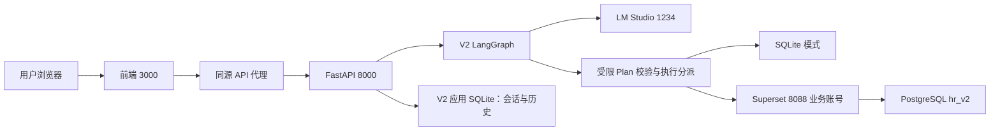
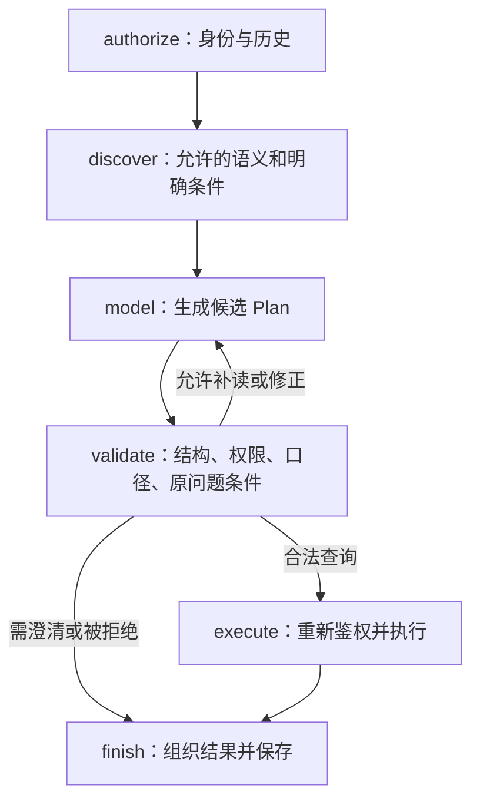

# 整个项目的代码目录与执行逻辑导读

更新时间：2026-09-20。本文依据 `codex/v2-superset-integration` 分支代码整理，业务实现基线为 `2b70008`。这次补充文档和中文注释，不改变业务规则或查询行为。

这是一份从目录走到调用链的源码地图。若要手动重做 PostgreSQL 导入、Superset 用户/角色/RLS 配置，请配合 [V2 Superset 实施讲义](V2_SUPERSET_IMPLEMENTATION_GUIDE.md)。完整专题导航见 [文档索引](index.md)。

## 1. 先分清分支、版本和运行模式

当前 Git 分支的准确名称是 **`codex/v2-superset-integration`**。可以称为“V2 的 Superset 集成分支”，并不是一个名为 `V2` 的分支。

Git 分支决定检出的代码；页面路径决定打开哪个界面；环境变量决定 V2 使用哪个查询后端。三者是不同的概念。**检出此分支后运行 `npm run demo`，V2 仍默认使用 SQLite；要启用 Superset，应运行 `npm run demo:superset`。**

| 实现 | 页面 / API | 业务数据 | 主要用途 |
|---|---|---|---|
| 原版 HR，文中简称 V1 | `/`、`/api/*`，排除 `/api/v2/*` | `data/hr.sqlite`，多表合成数据 | 考勤、教育、人员、图表和个人看板的早期综合演示 |
| V2，SQLite 模式 | `/demo`、`/api/v2/*` | `data/v2_people.sqlite`，300 人、26 字段 | 最小宽表、多指标、表格核验、原应用权限算法 |
| V2，Superset 模式 | 同一个 `/demo`、同一套 `/api/v2/*` | PostgreSQL `hr_v2` | 沿用 V2 Agent，经业务用户的 Superset 数据集与 RLS 查询 |
| OpenFGA 实验 | 独立端口 `8091` | 独立的 12 人样本及引擎状态 | 学习声明式关系授权，不在当前 V2 查询链中 |
| Superset 通用实验 / 课堂 | 独立端口 `8088` | PostgreSQL `hr_lab` | `HR_LAB_*` 演示、`LEARN_*` 手填权限课堂 |

V2 切换到 Superset 不会把 V1 考勤表自动迁过去，也不会同时启用 OpenFGA。原版“24 张业务表、480 人、17 个正式指标”的介绍不能当作 V2 的字段能力。

### 建议阅读顺序

| 顺序 | 先读什么 | 要搞懂的问题 |
|---|---|---|
| 1 | 本文第 2～4 节 | 哪个目录属于哪个版本，数据在哪里 |
| 2 | `v2/schema.py`、`v2/registry.py` | 模型能选择什么字段、指标和查询结构 |
| 3 | `v2/graph.py`，配合第 5 节 | 一句话怎样变成可执行计划 |
| 4 | `v2/auth.py`，配合第 6 节 | 谁在查询，为什么只能看到这些人 |
| 5 | `v2/superset_source.py`、`v2/superset_query.py` | 怎么绑定 Superset 账号、生成受控查询 |
| 6 | `v2/service.py`、`v2/reference.py` | 怎么组织答案、核验、保存历史和下钻 |
| 7 | `components/demo/`，配合第 7 节 | 页面状态如何连接后端 |
| 8 | 第 9～12 节 | 原版、实验、启动和后续修改从哪里入手 |

上述 `v2/` 均指 `backend/hr/v2/`。不必先读完通用 UI 组件或整份测试报告，先跟通一条查询。

## 2. 目录总览

下图列出全部主要目录及业务入口；通用 UI 文件和生成物按类别合并，避免把源码地图变成依赖文件清单。

```text
Smart_hr_database/
├── app/                              # 页面路由与浏览器同源 API 代理
│   ├── layout.tsx                    # 页面公共外壳、全局样式
│   ├── page.tsx                      # 原版入口 /
│   ├── demo/page.tsx                 # V2 入口 /demo
│   ├── demo/debug/page.tsx           # 独立节点调试页
│   └── api/[...path]/route.ts        # /api/* 转发到本机 FastAPI
├── components/
│   ├── demo/                        # V2 专用界面、表格、核验、权限、调试
│   ├── hr/                          # 原版 HR 专用界面
│   └── ui/                          # 按钮、弹窗、菜单等通用组件
├── backend/hr/
│   ├── api.py                       # 唯一主 FastAPI 应用；同时挂载 V1 和 V2
│   ├── config.py                    # 数据路径、模型地址、固定演示日期
│   ├── agent.py / workflow.py       # 原版模型入口与 LangGraph 图
│   ├── security.py / query.py       # 原版权限与 SQL 编译执行
│   ├── db.py / seed.py / schema.sql # 原版数据库连接、造数、建表
│   ├── catalog.py / semantics.py    # 原版指标目录和语义文档发布/检索
│   ├── semantic_schema.sql          # 原版语义库结构
│   ├── education.py / intent.py     # 原版教育查询与明确条件校验
│   ├── models.py / metadata.py      # 原版请求类型与说明元数据
│   ├── debug.py / data_dictionary.py# 原版调试记录和数据库字典
│   ├── validate.py                  # 原版合成数据规则校验
│   └── v2/
│       ├── api.py                   # /api/v2 接口
│       ├── schema.py                # 26 字段、15 指标、Plan 类型与结构约束
│       ├── registry.py              # 别名、正反含义、按权限披露的语义目录
│       ├── graph.py                 # V2 LangGraph：鉴权→检索→计划→校验→执行
│       ├── grounding.py             # 明确条件提取、补齐及追问一致性检查
│       ├── auth.py                  # 会话、权限入口、范围、指纹、旧模式配置
│       ├── query.py                 # 共同校验、SQLite 编译器、执行后端分派
│       ├── superset_source.py       # Superset 业务身份、授权快照、跨出口撤权
│       ├── superset_query.py        # Plan → Chart Data 请求 → PostgreSQL 结果
│       ├── service.py               # 摘要、核验、历史、下钻等应用服务
│       ├── reference.py             # 独立 Python 参考计算和离线 BFS
│       └── store.py                 # V2 合成数据、SQLite、默认角色策略
├── integrations/
│   ├── superset/
│   │   ├── compose.yaml / Dockerfile# 固定版本 Superset 与 PostgreSQL 实验环境
│   │   ├── lab.sh / prepare.py      # 环境准备、启动、检查、停止
│   │   ├── superset_config.py       # 元数据库、模板能力、安全与运行配置
│   │   ├── bootstrap.py/schema.sql # HR_LAB 通用权限实验初始化
│   │   ├── validate.py/fixtures.json# 通用实验校验及合成事实
│   │   ├── classroom/              # LEARN 订单课堂：生成/初始化/手工练习/验证
│   │   ├── v2/                     # 完整 V2 导入和 Superset 对象配置
│   │   └── .local/                 # 本机凭据、动态 ID、恢复快照；Git 忽略
│   └── openfga/
│       ├── model.fga               # 官方 DSL 表达关系递归与能力交集
│       ├── fixtures.json           # 独立 12 人样本和角色配置
│       ├── core.py                 # 配置校验、直接关系元组、真实引擎调用
│       ├── server.py / static/     # 独立演示 API 和网页
│       ├── runtime.py / test_lab.py# 运行官方引擎及独立测试
│       └── .local/                 # 引擎程序、数据库、日志；Git 忽略
├── semantic/                        # 原版 JSON 语义定义，不是 V2 定义源
├── evaluation/                      # V2 20 题、标准 Plan、参考结果、口语变体
├── tests/                           # 原版与 V2 的默认 pytest 回归
├── scripts/                         # 开发启动、评测、冒烟、基准、打包脚本
├── reports/                         # 已保存的测试与模型评估证据
├── docs/                            # 架构、业务、教学和实施文档
├── .github/workflows/               # 主 CI、Superset/OpenFGA 验证、打包
├── public/                          # 图标等静态资源
├── hooks/ / lib/                    # 移动端 hook、样式等少量公共工具
├── data/                            # 本机生成的 SQLite 数据与状态；Git 忽略
├── infomations/                     # 本机业务沟通资料；Git 忽略，不是运行依赖
├── package.json / package-lock.json # 前端命令和锁定依赖
├── pyproject.toml / uv.lock         # Python 依赖、测试与 lint 配置
├── vite.config.ts / next.config.ts  # Vinext/Vite、路由兼容和开发配置
├── tsconfig.json / components.json # TypeScript 和组件脚手架配置
├── .env.example                    # 可导出的环境变量示例
├── 启动演示.command                # 共享前后端生产构建模式入口；V2 默认 SQLite
└── README.md / PRODUCT.md / DESIGN.md # 仓库说明、产品/视觉背景
```

`node_modules/`、`.venv/` 是安装依赖；`dist/`、`.vinext/`、`*.tsbuildinfo` 是构建或缓存输出。学习和修改业务时不要编辑这些目录。`infomations/` 和运行数据不属于公开源码交付，新检出仓库可能没有它们。

## 3. 技术栈与进程之间的关系

| 层 | 本项目使用的技术 | 作用和源码入口 |
|---|---|---|
| 前端 | React 19、TypeScript、Vinext/Vite | 使用 `app/` 风格路由，实际命令是 `vinext dev/build/start`，不是标准 Next.js 服务 |
| 表格 | AG Grid Community | 列筛选、排序、分页、选择文字与下钻交互 |
| 后端 | FastAPI、Pydantic、httpx | HTTP 接口、严格请求结构、模型及 Superset HTTP 调用 |
| Agent 流程 | LangGraph | 有边界的状态图和条件路由，而非无限循环自由调用工具 |
| 本地模型 | LM Studio 的兼容接口 | `/v1/chat/completions` 产生 JSON Plan；默认模型标识 `hr-qwen` |
| 默认业务数据 | SQLite | 原版多表库与 V2 宽表库彼此独立 |
| V2 新查询链 | Superset 6.1.0 + PostgreSQL 17.11 | 数据集访问、RLS 与数据库内筛选/聚合 |
| 独立关系实验 | OpenFGA | 只在 `integrations/openfga/` 运行，不是当前 Agent 的隐含依赖 |

确切安装版本以 `package-lock.json`、`uv.lock` 和实验镜像配置为准。开发示例沿用 Node.js 24、Python 3.13；Python 项目声明支持范围为 `>=3.12,<3.15`。



V1 与 V2 在同一个 FastAPI 进程里，但分别使用自己的路由、请求模型、权限和数据。主应用启动时仍准备 V1 的本机库，因此 Superset 模式不代表启动过程完全不触碰 SQLite。

| 端口 | 用途 | 说明 |
|---|---|---|
| 3000 | 两版前端 | `/` 与 `/demo` 并存 |
| 8000 | FastAPI | `/api/docs` 可查看接口结构 |
| 1234 | LM Studio | 默认模型服务 |
| 8088 | Superset | Web 管理、看板和 Chart Data API |
| 55432 | PostgreSQL 宿主机入口 | 容器之间使用 `postgres:5432` |
| 8091 / 8090 / 8092 | OpenFGA 页面 / HTTP / gRPC | 独立实验，不需要为 V2 Superset 查询启动 |

## 4. 数据、语义和权限配置分别放在哪里

### 4.1 原版和 V2 的存储分工

| 位置 | 内容 | 主要读写者 |
|---|---|---|
| `data/hr.sqlite` | 原版员工、任职、考勤、教育等多表事实 | `seed.py` 写入，原版 `query.py` 只读查询 |
| `data/app.sqlite` | 原版身份、会话、指标发布、看板、问答、审计、调试 | 原版 API / security / debug / catalog |
| `data/semantic.sqlite` | 原版 JSON 语义定义发布后的可检索文档 | `semantics.py` |
| `data/v2_people.sqlite` | V2 人员宽表与快照元信息 | `v2/store.py`；也是迁移导出和离线参考源 |
| `data/v2_app.sqlite` | `settings`、`sessions`、`runs`、`audit` | V2 会话、策略、历史、审计 |
| PostgreSQL `hr_v2.v2_data.people` | 导入后的完整 V2 宽表 | 导入脚本维护；Superset 经视图读取 |
| PostgreSQL `hr_v2.v2_auth.*` | 身份映射、角色策略、快照及关系视图 | 初始化/受控配置程序，查询视图读取 |
| PostgreSQL `hr_v2.v2_api.*` | 人员、事件、身份上下文出口 | 两个只读数据库账号 |
| PostgreSQL `superset_meta` | Superset 用户、角色、数据源、数据集、RLS、图表等 | Superset 自身 |

`HR_DATA_DIR` 可调整本机应用数据目录。`v2/store.directory()` 使用 `config.APP_DB.parent`，所以测试通过替换应用库路径，就能隔离 V2 的人员与会话/历史文件。

### 4.2 V2 宽表与语义目录

[schema.py](../backend/hr/v2/schema.py) 同时定义：

- `FIELDS`：26 个业务字段，分为 basic、education、employment、contract 四组。
- `METRICS`：15 个可执行指标，包含人数、入离职、净增、学历/院校比例、外包比例、平均年龄和平均转正天数。
- `DIMENSIONS`：允许的部门、教育、用工等维度，以及关系与月份维度。
- `Plan / Filter / Order / Question`：API 和模型输出必须遵循的结构。

[registry.py](../backend/hr/v2/registry.py) 再把这些定义组成对模型和页面可读的条目：完整 ID、别名、说明、反义边界、依赖字段、分母/空值口径和允许的部门候选。

例如 `people.school_name` 是字段完整 ID；`metric.masters_ratio` 是指标完整 ID。学校是宽表**当前教育记录**，不是任意历史教育经历；硕士及以上比例的分母是同组全部人群，不能先过滤到硕士再计算比例。

V2 的权威语义定义现在是 **Git 中的 Python 目录**，没有向量数据库。原版 `semantic/*.json → semantic.sqlite` 是另一套发布链；只修改这些 JSON 不会给 V2 新增字段。

### 4.3 时间与组织假设

固定快照日是 `2026-09-11`，不是操作系统今天。相对时间由 `graph.date_hints()` 解释；在职判断采用 `入职日 <= 快照日` 且 `离职日为空或晚于快照日`，离职当天不算在职。

宽表不保留历史任职和历史汇报线，历史入离职事件也按当前部门分组。`person_id` 是人员主键，`employee_no` 是保留前导零的工号；主管/HRBP 关联 `person_id`。`dept_master_id` 当前不单独产生授权。

## 5. 一次 V2 提问的完整执行流程

以王灏提问“其中可信与 AI 实验室有多少在职员工”为例，前提是已经有一轮成功查询作为追问上下文。

### 5.1 浏览器只提交问题和上一轮 ID

[workspace.tsx](../components/demo/workspace.tsx) 提交 `POST /api/v2/chat`，核心内容为 `question` 和可选 `previous_id`。浏览器不提交 Superset 密码、数据库连接或授权人员列表。

[API 代理](../app/api/[...path]/route.ts) 把请求转发给 FastAPI，并保留会话 cookie 与 CSRF 请求头。V2 的 [api.checked()](../backend/hr/v2/api.py) 读取会话主体，再校验 CSRF。

### 5.2 LangGraph 的六个实际节点

[graph.py](../backend/hr/v2/graph.py) 底部 `_builder` 定义图的拓扑，`GRAPH` 是编译后的图。`answer()` 是对外入口。



| 节点 / 函数 | 主要输入 | 主要输出与约束 |
|---|---|---|
| `authorize()` | 服务端 principal、上一轮 ID | 重新检查会话与指纹；从本人有效成功记录取上一轮 Plan |
| `discover()` | 问题、权限内目录、上一轮 Plan | 字段/指标索引、相关详细定义、部门候选、时间和明确条件 |
| `model_node()` → `call_model()` | 上述 messages 与 Plan JSON Schema | 未信任的候选 JSON、模型请求/用量等调试信息 |
| `validate_node()` | 候选 JSON 与原始问题 | 严格 Plan，或者 `inspect`、`clarify`、`blocked` 分支 |
| `execute_node()` | 合法 Plan、最初指纹 | 再次鉴权、调用 `service.run_query()`，记录真实 SQL/结果 |
| `finish_node()` | 执行或澄清结果 | 确定性摘要、查询 ID、历史父 ID、trace |

调试界面可能显示超过六条记录：时间、条件对齐、补读、修正等都会留下 trace。**图中的节点数量和界面中的调试条目数量不要求相同。**

模型最多补读两轮详情，流程还限制模型尝试次数、校验修正次数、图递归步数与总超时；`answer()` 使用共享 `_gate` 限制并发模型请求。不能把它当作可以无限反复试 SQL 的 Agent。

### 5.3 为什么还有 grounding

[grounding.py](../backend/hr/v2/grounding.py) 处理可确定识别的条件，例如日期、全日制、硕士及以上、学校替换和追问继承。明细列的提问语义主要由模型和提示词决定；后端检查列非空、白名单和字段权限，目前没有对任意中文提问逐列证明其列选择完全正确。

- `constraints()`：从问题和前次 Plan 提取明确约束。
- `normalize()`：补齐有规则依据的条件，并把补齐过程写入调试记录。
- `check()`：检查最后 Plan 是否遗漏问题中的要求。
- `needs_previous()`：识别“这些人”“其他条件不变”等依赖上下文的表达。

它是有限规则校验，不是通用自然语言理解器。经过规则补齐才正确的结果，评测里不能算成“模型原始计划完全正确”。缺少历史或无法表达的条件，应澄清，不能悄悄改成更简单的问题。

### 5.4 模型输出的 Plan 长什么样

下面是部门在职人数的合法结构示例，未写出的字段采用 Pydantic 默认值：

```json
{
  "kind": "aggregate",
  "scope": "all",
  "population": "active",
  "departments": ["可信与AI实验室"],
  "filters": [],
  "group_by": [],
  "metrics": ["count"],
  "columns": [],
  "page": 1,
  "page_size": 50
}
```

`scope=all` 表示当前身份的全部授权范围，不是全公司。`kind=people` 才是人员明细；`inspect` 用于补读定义；`clarify` 表示暂不执行。

结构上最多 5 个指标、2 个分组维度、12 个明细字段、12 个筛选，单次日期跨度最多 366 天。`query.validate()` 还会进一步检查字段依赖、排序、日期与指标匹配、事件人群和明细权限。比例分母由编译器在当前筛选后人群上计算；“不要先筛到硕士再求硕士比例”的要求主要由口径披露与提示词约束，目前没有硬校验覆盖所有这类语义误解。

### 5.5 两种查询后端怎样接在同一条链上

[query.execute()](../backend/hr/v2/query.py) 依据 `HR_V2_QUERY_BACKEND` 分派：

| 后端 | 编译与执行 | 最终行范围 |
|---|---|---|
| `sqlite`（默认） | `query.Compiler` 构造参数化 SQL，SQLite 只读连接执行 | 应用算出的授权集合与业务条件取交集 |
| `superset` | `superset_query.Compiler` 生成已注册数据集的 Chart Data 请求 | Superset 注入当前用户 RLS，PostgreSQL 再做筛选和聚合 |

两者共用 Plan 和业务校验，但 SQL 方言、执行身份与授权机制不同。Superset 编译器只从固定模板和白名单生成表达式，字符串值通过 `literal()` 转义；没有模型自由 SQL、管理员 SQL Lab 代理或临时任意 SQL 数据集。

Superset 模式下，筛选、去重人数、分子分母、平均数和事件统计在 PostgreSQL 执行；Agent 仍负责最终排序、页面切片、补齐零月份和摘要。当前实现为了全量核验会读取有上限的结果，不能因为前端有分页就声称已实现数据库大规模分页。

### 5.6 返回结果和自然语言

查询结果含 `plan`、`columns`、`rows`、`totals`、`total_rows`、`sql`、`parameters` 等；Superset 还给出 `execution_backend` 和 `source_queries`。

[service.summary()](../backend/hr/v2/service.py) 从已计算的单元格形成中文回答，不再让另一个模型自由改写数字。聊天结果经 `save_run()` 保存；直接手动 `/query` 用于表格刷新，不等于又保存一轮对话。

## 6. 权限逻辑：从身份到 SQL 的每一层

### 6.1 演示身份与会话

[auth.session()](../backend/hr/v2/auth.py) 接受固定 persona，生成随机 cookie token，把 token 的哈希、CSRF 和过期时间保存在 `v2_app.sqlite.sessions`。`principal()` 读取有效会话，`refresh()` 在关键步骤重新确认会话未失效。

本机身份选择器允许操作者切换五个身份，**不是企业员工登录认证**。它用于演示不同身份的查询结果；生产需要用可信登录身份替换此入口。前端隐藏字段和按钮也不构成服务端权限边界。

### 6.2 V2 SQLite 模式的汇报线与 HRBP

`auth.grants()` 在原人员宽表上计算四类来源：本人、管理线下属、本人 HRBP 服务对象、继承下属 HRBP 服务对象。管理线递归沿 `head_person_id`，不沿 `dept_hrbp_id` 任意扩张。

`grants()` 返回完整授权集合和来源；`scoped()` 再按问题缩小到 `self/reports/direct/indirect/hrbp/inherited_hrbp`。部门筛选也只会缩小集合。

在 V2 当前规则中，继承 HRBP 同时要求 `reports` 与 `inherit_hrbp` 开关。独立 OpenFGA 实验的继承开关语义有所不同，不能把两份实验配置不加确认地互相复制。

### 6.3 Superset 模式的身份与授权入口

此模式下 `auth.grants()/people()/policy()/allowed_fields()/fingerprint()` 转入 [superset_source.py](../backend/hr/v2/superset_source.py)，不在线调用原 Python 遍历来决定最终放行。

1. `identity()` 从后端本机 manifest 把已选 persona 对应到 Superset 业务账号，核对人员和角色，拒绝用配置管理员代替业务身份。
2. `session()` 用该业务账号登录 Superset，取得临时 token 与 CSRF；凭据不交给模型或浏览器。
3. `snapshot()` 查询受 RLS 约束的 `context`，核对身份唯一性、人员/角色匹配、快照日及关系图有效性。
4. 读取当前用户允许的人员快照，用于语义目录、关系解释、参考核验和指纹。
5. 实际业务查询仍通过 `superset_query.execute()` 再请求 Superset，不能用一次快照取代最终 RLS。

`counted_listing()` 同时比较计数与列表长度，`checked_scope()` 校验查看人 ID、人员/事件键和重复记录。当前最多 1000 人、2000 个授权事件标识，超出或不完整时拒绝处理；上游错误不会被当作“零人”，也不会回退到 SQLite。

### 6.4 Superset、PostgreSQL、应用分别负责什么

| 层 | 做什么 | 关键文件 |
|---|---|---|
| PostgreSQL 业务视图 | 递归汇报线，合并 HRBP 与继承来源，检查环和无效引用 | [schema.sql](../integrations/superset/v2/schema.sql)、[setup.py](../integrations/superset/v2/setup.py) |
| Superset 平台 | 业务用户登录、角色的数据集访问、Base RLS 用户绑定 | 初始化在 `setup.py`，运行配置在 Superset 元数据库 |
| 数据库只读账号 | 限制可访问视图；基础视图不含合同两列 | `setup.prepare_database()` |
| Agent | 可信会话到业务账号映射、字段依赖、Plan 白名单、明细/导出开关、历史失效 | `auth.py`、`superset_source.py`、`query.py`、`service.py` |

三条 Base RLS 分别绑定公共人员/事件、合同人员/事件和身份上下文，条件为：

```sql
-- 人员/事件数据集的条件片段
_viewer_id = {{ current_user_id() }}

-- 身份上下文数据集的条件片段
superset_user_id = {{ current_user_id() }}
```

两个 PostgreSQL 只读账号是共享连接账号，不代表最终员工；**绕过 Superset 直接用共享账号查询，不能认为仍有用户级 RLS**。真实行隔离依赖 Superset 的业务身份和受控查询路径。

合同列采用物理视图/账号隔离；其他字段组的组合仍有应用校验。应用的 `details/export` 开关不会自动禁用 Superset 原生页面的明细或下载功能。

### 6.5 权限修改后，历史为什么失效

`auth.fingerprint()` 在 Superset 模式会重新查询各个必需出口：公共人员、公共事件；合同身份再加合同人员、合同事件。指纹包含当前身份、策略/数据上下文、授权数据、各出口可见键及数据集 ID。

因此“HR 的合同人员快照没变，但公共 RLS 收窄”也会使旧历史失效。任一必需出口访问权被撤销，当前实现保守地拒绝整个请求。`service.history()/read_run()` 同时匹配记录 owner 与当前指纹；模型执行前后、查询返回前、保存历史和导出前也做检查。

这些检查有查询开销，是小样本演示的明确取舍，不代表已经解决企业级分布式权限版本和数据库事务一致性的全部问题。

### 6.6 “169 人”与“57 人”怎样解释

当前合成样本中，王灏可见 179 名候选人员，包含离职；按当前在职筛选得到 169 人。再限定当前部门“可信与 AI 实验室”，得到 57 人。

三个条件对应三件事：**当前用户 RLS 决定上限 → 在职口径确定人群 → 部门条件进一步筛选**。跨部门下属仍可能在授权范围里，所以“权限范围”不能直接替换成“本人部门”。

## 7. 前端代码如何阅读

### 7.1 V2 组件职责

| 文件 | 作用 | 重点阅读 |
|---|---|---|
| [workspace.tsx](../components/demo/workspace.tsx) | 身份加载、导航、聊天、追问、历史、目录 | `DemoWorkspace` 管身份；`Workspace` 管当前界面和会话 |
| [types.ts](../components/demo/types.ts) | Plan/Result/Bootstrap 类型、默认计划、统一请求 | 请求封装是 `/api/v2` 调用的共同入口 |
| [builder.tsx](../components/demo/builder.tsx) | 可视化修改指标、维度、时间和筛选 | 把用户选择还原成同一种 Plan |
| [grid.tsx](../components/demo/grid.tsx) | 查询表格与静态关系表格 | `gridPlan()`、`QueryGrid`、`StaticGrid` |
| [result.tsx](../components/demo/result.tsx) | 摘要、条件、结果表、SQL、对账、导出、下钻 | 依据当前有效 Plan 发请求，不能只处理当前页 |
| [permissions.tsx](../components/demo/permissions.tsx) | 关系来源与旧模式角色配置 | Superset 模式下旧配置编辑被停用 |
| [debug-workspace.tsx](../components/demo/debug-workspace.tsx) | 独立调试页，历史选择、节点输入/输出 | 从后端读取本人仍有效的 runs，不是前端伪造流程 |
| [debug-link.tsx](../components/demo/debug-link.tsx) | 携带查询 ID 跳到调试页 | `/demo/debug?run=...` |
| `workspace.css`、`debug-workspace.css` | 问数和调试页面样式 | 红色主题、布局、输入框、移动端适配 |

`components/ui/` 放通用按钮、表单、弹窗、下拉、布局等组件；`components/hr/` 是原版界面，不要为了修改 `/demo` 去调整原版 `workspace.tsx`。

### 7.2 身份和异步状态

`DemoWorkspace` 首次读取 `/api/v2/bootstrap`；没有会话时自动选 HR 主管作为演示默认身份。用户切换身份会重新建立会话和读取目录。

组件 key 包含身份、策略版本和指纹，改变后重新挂载页面，清理旧结果。代码中的 `epoch` 防止较早的异步请求覆盖新身份；`AbortController` 取消无用请求。另有 30 秒的 bootstrap 检查，用于感知其他标签页的会话/权限变化，**不是后台周期性调用模型**。

前端请求取消不等于后端模型一定已立即中断；不能据此假设可以无限并发发送。后端还有独立的 `_gate` 并发限制。

### 7.3 Excel 风格表格实际怎么筛选

`QueryGrid` 使用 AG Grid Community 的 infinite row model，每页/块 50 行，限制并发数据请求。它没有使用付费版 Server-Side Row Model。

列筛选和排序经过 `gridPlan()` 转换为 Plan，然后重新请求 `/api/v2/query`。因此不是仅在已下载的这一页里筛选；后端仍会检查字段和权限。列头暂支持有限操作，多值 OR 可在条件编辑器里用 `in` 表达，不能假定实现了完整 Excel 公式或任意透视表。

当前后端按演示上限取完整结果后进行稳定排序/页面切片，统计 SQL 本身在所选数据库执行。前端分页协议与后端大数据性能是两个层面。

### 7.4 核验、下钻、导出、多轮

- **核验**：`/verify` 比较 SQL 结果与独立 Python 计算，返回差异、合计和哈希；Superset 模式的 Python 输入已经被授权，在线核验本身不独立证明授权范围正确。
- **下钻**：`service.drill_plan()` 先确认分组确实存在，再把该分组和指标转换成明细条件；净增没有单一人员集合，需要分别看入职或离职。
- **导出**：使用全部匹配结果和当前权限，不只导出当前页；CSV 处理公式注入和工号前导零。
- **多轮**：保存的是明确的上一轮 ID/Plan，不是把整个聊天窗口当成永久记忆。恢复历史要经过当前身份与指纹校验。
- **节点调试**：展示真实请求、候选 Plan、校验、SQL、结果和耗时。当前 V2 以保存后的 run 为读取单位，不是逐 token 的实时流式面板。

## 8. V2 接口清单与关键约束

下表路径均加前缀 `/api/v2`。除健康检查和创建演示会话外，接口读取当前会话；受保护的 POST 请求经 `checked()` 检查 CSRF。

| 方法 | 路径 | 输入 / 用途 |
|---|---|---|
| GET | `/health` | 配置后端、数据版本、快照日；不是完整上游查询探针 |
| POST | `/session` | `{persona_id}`；创建/切换演示会话 |
| GET | `/bootstrap` | 当前主体、权限、目录、模型状态、指纹 |
| POST | `/chat` | `{question, previous_id?}`；走 LangGraph |
| POST | `/query` | `Plan`；直接执行，供条件编辑和表格刷新 |
| POST | `/verify` | `Plan`；全量行与合计对账 |
| POST | `/drill` | `{plan, group, metric}`；从聚合转明细 |
| POST | `/export` | `Plan`；校验导出权限后返回 CSV |
| GET | `/history` | 本人、当前指纹的最近 100 条记录 |
| GET | `/history/{rid}` | 恢复单条结果和 trace；不可跨用户或跨旧指纹读取 |
| GET | `/cases` | 固定演示题单，不是生产规划器的查答案入口 |
| GET | `/relations` | 当前可见人员及来源；未授权路径节点不补查姓名 |
| GET | `/policy` | SQLite 模式配置管理员查看完整角色策略 |
| POST | `/policy/preview` | 预览规则变更对可见范围的影响 |
| POST | `/policy/apply` | 以版本约束应用旧模式规则变更并审计 |

Superset 模式拒绝通过后面三个本地策略接口改权限，防止“只修改 SQLite，实际 Superset 没生效”。正式对象模型请看 [api.py](../backend/hr/v2/api.py)、[schema.py](../backend/hr/v2/schema.py) 和 [auth.py](../backend/hr/v2/auth.py)。

主应用 [backend/hr/api.py](../backend/hr/api.py) 的中间件同时覆盖 V1/V2：受信 Host/Origin、跨站限制、请求体大小限制、会话维度限流、不缓存私人结果等。示例限制为聊天每分钟 12 次、其他请求每分钟 180 次；它们是单进程演示限制，不是生产网关方案。

## 9. 原版代码与独立权限实验

### 9.1 原版后端和前端

原版主链为 `api.chat → agent.answer → workflow.run → QueryPlan 校验 → query.execute`。[workflow.py](../backend/hr/workflow.py) 使用自己的 LangGraph，涵盖能力判定、历史上下文、语义检索/披露、模型计划、条件检查、重新鉴权、查询和持久化。

| 文件组 | 作用 |
|---|---|
| `db.py`、`schema.sql`、`seed.py`、`validate.py` | 业务库只读连接、模拟多表数据与一致性规则 |
| `security.py` | 原版会话、汇报闭包/组织/本人范围、CSRF 和审计 |
| `models.py`、`query.py`、`intent.py` | 原版 Plan、参数化 SQL、明确条件不能丢弃的校验 |
| `education.py` | 原版多段教育经历、院校筛选与统计表达式 |
| `catalog.py`、`semantics.py`、`semantic_schema.sql` | 正式指标发布、JSON 定义转语义库、权限内检索与按需补读 |
| `metadata.py`、`data_dictionary.py` | 业务说明和从真实数据库结构生成字典 |
| `debug.py` | 原版独立调试 run/step 记录、错误信息与历史权限 |
| `config.py`、`agent.model_status()`、`agent._gate` | 两版复用的数据/模型设置、模型连通检测与进程内并发门 |

原版 `components/hr/workspace.tsx` 组织界面；`client.ts` 和 `types.ts` 负责请求/类型；`views.tsx`、`charts.tsx`、`results.tsx` 展示业务结果；`semantic-center.tsx`、`data-dictionary.tsx`、`debug-panel.tsx` 对应语义、数据库字典和调试。

原版个人看板保存查询计划，读取时按当前权限重新执行；V2 的 `runs` 是聊天/调试历史。不能把两者当作同一张表或同一套 API。

### 9.2 Superset 目录中的三套示例

| 目录 | 入口文件 | 内容 |
|---|---|---|
| `integrations/superset/` 根目录 | `lab.sh`、`prepare.py`、`bootstrap.py` | 环境与最初的通用权限实验 |
| `integrations/superset/classroom/` | `generate.py`、`run.py`、`setup.py`、`verify.py` | 订单课堂，支持用户手填角色和 RLS；`test_data.py` 检查生成事实 |
| `integrations/superset/v2/` | `run.py` | 完整 HR V2 导入、配置与校验 |

V2 集成文件进一步分工：

| 文件 | 核心职责 |
|---|---|
| [export.py](../integrations/superset/v2/export.py) | 导出当前 V2 人员、persona、角色策略、字段目录、指纹 |
| [run.py](../integrations/superset/v2/run.py) | 宿主机 CLI；定位既有容器、写受限本机资料、调度容器内脚本 |
| [setup.py](../integrations/superset/v2/setup.py) | 创建库、只读账号、宽表/出口视图，以及 Superset 用户/角色/数据集/RLS/看板 |
| [schema.sql](../integrations/superset/v2/schema.sql) | 角色策略、映射、管理递归、HRBP 合并、图健康检查 |
| [status.py](../integrations/superset/v2/status.py) | 只读盘点实际对象和可见人数 |
| [verify_storage.py](../integrations/superset/v2/verify_storage.py) | 核对完整导入、数据库拒绝边界及配置数量 |
| [probe.py](../integrations/superset/v2/probe.py) | 可逆撤权测试的故障注入/恢复助手，不在查询主链使用 |

`setup` 首次初始化，重复执行保留已存在业务数据/手工角色和 RLS，但重新应用代码视图；`sync-data` 才明确重导数据与业务策略。二者都不是接真实 HR 库的 CDC 同步程序。

`.local/v2/credentials.json` 是 Superset 登录密码；`database-credentials.json` 是 PostgreSQL 连接资料；`manifest.json` 是动态账号/数据集映射。均留在本机，不进入模型提示、浏览器响应或 Git。

### 9.3 OpenFGA 实验怎样运行

[model.fga](../integrations/openfga/model.fga) 描述管理线递归、HRBP 及能力交集；[core.py](../integrations/openfga/core.py) 只把人员事实转成直接关系元组，实际权限判断调用真正的 OpenFGA Server。

发布配置会校验事实，使用官方 CLI 编译 DSL，把模型与关系写到新的 Store，执行验证后切换当前配置指针。查询通过 BatchCheck 求权，再限制演示行/字段/导出。这里没有以应用自写递归结果替代引擎判断。

`runtime.py` 管理固定版本官方二进制与本任务进程；`server.py` 提供独立网页 API；`static/` 是不经过 V2 React 应用的原生网页。详情见 [OpenFGA 实验说明](../integrations/openfga/README.md)。

## 10. 验证、评测、脚本和 CI 怎样对应

### 10.1 不同验证回答不同问题

| 层次 | 位置 | 证明什么 |
|---|---|---|
| 数据规则 | `backend/hr/validate.py`、课堂 `test_data.py` | 合成事实与日期/引用规则是否自洽 |
| 权限、SQL、API 单元/回归 | `tests/test_v2_*.py`、原版 `tests/` | 已知输入下代码行为是否符合期望 |
| 固定题单与标准 Plan | `evaluation/demo-v2-cases.json`、`demo-v2-plans.json` | 定义问题和人工期望结构，不供生产模型查答案 |
| 独立参考 | `v2/reference.py`、`demo-v2-golden.json` | 与 SQL 不共用编译实现的计算参考 |
| 真实模型 | `scripts/evaluate_v2.py`、`demo-v2-paraphrases.json` | 模型理解、规则补齐和完整结果是否正确 |
| Superset 集成 | `scripts/validate_v2_superset.py` | 真实数据库/平台权限、20 个计划及 HTTP 功能 |
| 撤权 | `scripts/validate_v2_superset_revocation.py` | 临时改权限/关系/RLS，旧结果能否被阻止，再精确恢复 |
| HTTP 冒烟 | `scripts/smoke_http.py`、`smoke_v2.py` | 已运行服务的入口和基本链路 |
| 性能 | `scripts/benchmark.py`、`benchmark_v2.py` | 指定本机样本和模式的耗时；不能外推生产容量 |
| 文档同步 | `scripts/document_schema.py`、`document_semantics.py` | 原版结构/语义文档的生成与一致性检查 |

`reference.independent_scope()` 用独立 BFS 验证原始权限名单；Superset 在线 `/verify` 则只在已授权快照上独立计算。两者不能混为一谈：结果计算对得上不代表授权范围一定正确，也不代表模型理解了提问本意。

默认 `uv run pytest -q` 的 `testpaths` 是 `tests/`，不会自动包含 `integrations/openfga/test_lab.py` 和课堂测试。实验测试需单独运行。真实模型评测也不是默认 pytest 的一部分。

### 10.2 常用命令

```bash
# 默认回归：不要求实际模型推理
uv run pytest -q
uv run ruff check backend tests scripts integrations
npm run typecheck
npm run lint

# 真实 Superset 已初始化后，执行只读集成回归
uv run python integrations/superset/v2/run.py verify-storage
uv run python scripts/validate_v2_superset.py

# 撤权脚本会短暂修改并恢复 V2 配置，不要与现场演示同时运行
uv run python scripts/validate_v2_superset_revocation.py

# 真实本地模型；单独选择查询后端和报告路径
HR_V2_QUERY_BACKEND=superset uv run python scripts/evaluate_v2.py \
  --cases HR-01,HR-05,HR-16 --output reports/v2-superset-model-smoke.json
```

`scripts/check.sh` 和 `ci-smoke.sh` 涉及安装、构建或临时启动端口，不是“安全地重复检查现有服务”的同义词。运行前阅读脚本；模型推理、批量构建按本机负载与内存状况串行安排。

### 10.3 CI 与交付证据

| 工作流 | 职责 |
|---|---|
| `.github/workflows/ci.yml` | Python/前端检查、语义校验、构建、HTTP 冒烟 |
| `.github/workflows/superset-lab.yml` | Docker 环境、通用实验、课堂准备、V2 导入/查询/撤权 |
| `.github/workflows/openfga-lab.yml` | 启动真实关系引擎，跑独立实验测试 |
| `.github/workflows/release.yml` | 手动触发源码打包；没有自动发布到企业生产环境 |

上一轮 Superset 实施留下了 [51 项存储检查](../reports/v2-superset-storage.json)、[146 项集成检查](../reports/v2-superset-integration.json)、[28 项撤权检查](../reports/v2-superset-revocation.json) 和 [3 道真实模型题](../reports/v2-superset-model-smoke.json)。这些是报告记录的那次环境证据，不等于以后每次修改都自动重新通过，也不是本次注释工作重新执行了所有真实服务测试。

## 11. 启动与配置：避免跑错系统

### 11.1 当前 V2 Superset 版本

前提是按实施讲义准备好 Superset/PostgreSQL 和本机资料，再运行：

```bash
npm run demo:superset
```

打开 [V2 页面](http://127.0.0.1:3000/demo)，左下角展开“权限与模型状态”，应显示 Superset/PostgreSQL。`GET /api/v2/health` 返回 `query_backend: superset` 只能证明配置选择，实际查询和 SQL 才能证明链路成功。

已有 3000/8000 服务时启动器会拒绝重复启动。若要换模式，应先在原启动终端停止本项目实例；不要启动第二份，也不要终止不属于本项目的进程。

### 11.2 启动器与环境变量

[scripts/dev.mjs](../scripts/dev.mjs) 依次检查端口、缺失依赖、原版初始数据、LM Studio 服务和目标模型，然后启动后端与前端。Ctrl+C 停止本次启动的前后端，保留 LM Studio。

| 变量 | 默认 / 作用 | 读取位置 |
|---|---|---|
| `HR_MODE` | `demo`；其他值会被主应用拒绝 | `backend/hr/api.py` |
| `HR_DATA_DIR` | 仓库 `data/` | `backend/hr/config.py` |
| `LM_STUDIO_URL` | `http://127.0.0.1:1234/v1` | 模型配置 |
| `LM_STUDIO_MODEL` | `hr-qwen` | 模型配置和启动器 |
| `LM_STUDIO_TIMEOUT` | 90 秒单次模型 HTTP 请求 | 模型配置 |
| `HR_BACKEND_URL` | `http://127.0.0.1:8000` | 前端 API 代理 |
| `HR_V2_QUERY_BACKEND` | `sqlite`，也可为 `superset`；未知值拒绝 | `v2/superset_source.py` |
| `HR_V2_SUPERSET_URL` | `http://127.0.0.1:8088` | Superset 适配层 |
| `HR_V2_SUPERSET_DIR` | `integrations/superset/.local/v2` | 后端动态清单和凭据位置 |
| `HR_LAB_DOCKER_HOST` | Superset 工具使用的 Docker socket | 实验启动/导入脚本 |

Python 不会自动读取 `.env` 文件，使用 shell 导出环境变量或由 npm 命令传入。`npm run demo:production` 指前端使用生产构建，并不表示完成生产 SSO、安全审批或企业部署。

## 12. 以后要修改能力，应该改哪里

| 目标 | 必须关联考虑的文件和验证 |
|---|---|
| 增加 V2 业务字段 | `schema.FIELDS` → `store` 合成/导入 → PG 视图和数据集列 → `registry` 描述/别名/字段组 → 前端目录 → 正反权限和结果测试 |
| 增加一个指标 | `schema.METRICS` 及依赖 → SQLite 和 Superset 两个编译器 → `reference` 独立算法 → 模型披露/明确条件 → 标准 Plan 和结果回归 |
| 支持新口语或追问 | `registry` 别名、`graph.discover`、`grounding`，再补表达变体和原始计划/规则补齐结果检查 |
| 修改“直属、间接、HRBP继承”语义 | `auth.grants` 原模式、`schema.sql` 新模式、`reference.independent_scope` 独立期望；明确 OpenFGA 实验是否也需要改 |
| 新增一个演示身份 | `store.PERSONAS`、本机映射、PG identity_map/role_policy、Superset 账号角色一起配置；不能只新增前端选项 |
| 调整 Superset RLS / 数据集授权 | 管理页或受控配置程序，随后验证各角色、跨出口历史撤权、导出/调试没有旁路 |
| 修改聊天输入框和消息样式 | `components/demo/workspace.tsx`、`workspace.css`；注意输入法、Enter发送、多轮上下文 |
| 修改表格筛选/排序 | `grid.tsx`、`builder.tsx`，核对 Plan 是否支持，后端校验与全部匹配结果是否一致 |
| 修改节点调试内容 | 后端 `graph.record()` 的实际采集，与前端 `debug-workspace.tsx` 的展示一起看 |
| 改成正式业务库 | 重新确认主键、字段、口径和同步方案；当前 `sync-data` 只是演示快照导入 |

添加指标不能只改提示词；修改权限不能只改界面；改变数据结构后也不能指望既有 SQLite/PG 表自动完成迁移。当前脚本使用初始建表/受控重导方式，不是完整的版本化迁移平台。

## 13. 这次中文注释的阅读方法

注释集中覆盖项目自有主干，分三类：

1. **模块职责**：这个文件属于 V1、V2 还是独立实验，谁调用它。
2. **函数契约**：输入/输出是什么，是否访问数据库、调用模型或改变状态。
3. **关键原因和边界**：为什么要重新鉴权、为什么查合计、为什么不沿 HRBP 边递归、为什么不能只筛当前页。

没有给通用 UI 脚手架和每个简单赋值堆注释。Pydantic 类型定义和 FastAPI 路由优先使用普通注释，避免注释文本意外进入模型 JSON Schema 或自动 API 描述。验证时会比较 Python AST、前端去注释后的语法结构以及固定 DSL/SQL 的有效内容，确认补注释没有改变业务逻辑。

## 14. 排查问题时先看哪一层

| 现象 | 优先检查 |
|---|---|
| “怎么还是 SQLite” | 启动命令/进程环境、bootstrap 的 `query_backend`，不是 Git 分支名 |
| 查询人数和预期不同 | 先看 scope、population、部门、时间和标准口径；再看授权来源与真实 SQL |
| 模型漏条件 | 调试页“模型生成计划”→“明确条件绑定”→“提问条件对齐”，分别检查原始候选和最终 Plan |
| Superset 返回拒绝 | 当前实际业务账号、数据集角色、identity_map、三个 Base RLS，以及 contract 策略是否成套 |
| 刚能看的历史变成 404 | 当前身份/会话、授权出口、数据或配置变化导致指纹不匹配；不要通过去掉条件恢复旧记录 |
| 核验差异不为 0 | 对比完整结果与合计、时间边界、空值/分母、事件人数及当前授权快照 |
| 明细与某个聚合组对不上 | 查看下钻条件、净增是否误当明细、是否同时有入职/离职两种事件 |
| 本地模型忙碌 | `_gate`、请求超时、模型状态与本机负载；不要一边连续点击一边再跑模型评测 |
| 修改 Python 后页面没变化 | 后端启动命令默认未加自动 reload；注释修改无行为变化无需重启，功能修改后应重启本项目后端 |

学习结束后，你应能从一个问题指出：身份从哪里来、模型得到哪些上下文、Plan 的每一项意味着什么、谁决定权限范围、谁计算数字、历史何时失效，以及应该用哪一层测试验证改变。
