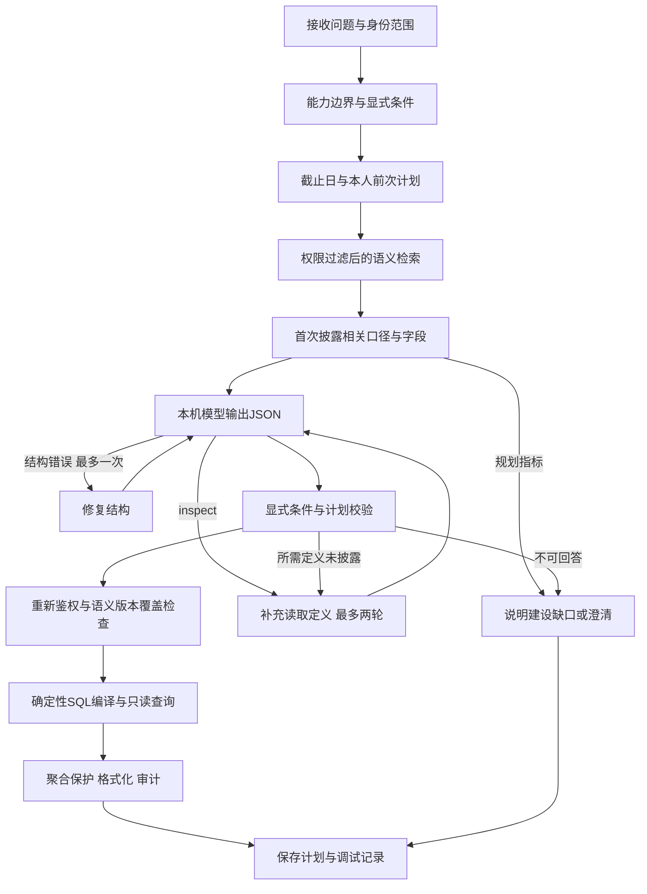

# HR语义层与LangGraph查询流程

更新：2026-09-14。当前为使用本机Qwen3.8-27B-MLX的合成数据演示，数据截止日保持2026-09-11。该文档描述实际实现；生产接入仍需企业SSO、权威口径审核与数据库隔离。

## 本次选择

采用 **真实LangGraph + Git JSON定义源 + 独立SQLite语义库 + 全文召回 + 渐进式披露**。这几项分别解决流程编排、定义维护、可查询发布、候选发现和上下文预算，不是互斥方案。

| 内容 | 存储位置 | 作用 |
|---|---|---|
| 24张HR业务表 | `data/hr.sqlite` | 员工、组织、任职、教育、考勤等事实；查询服务只读 |
| 身份、会话、看板、对话、审计、调试 | `data/app.sqlite` | 当前8个逻辑表/全文索引，与业务事实分离 |
| 表、字段、关系定义 | `semantic/tables.json`、`fields.json` | 可审阅的权威语义源，每个字段使用`表ID.字段ID` |
| 17个可执行指标 | `semantic/catalog.json` | 口径、别名、含义、排除含义、字段依赖与权限约束 |
| 15个规划指标 | `semantic/proposed-metrics.json` | 设计公式与建设缺口；禁止作为可执行指标 |
| 160个业务问题 | `semantic/questions.json` | 102个已支持指标问题、45个规划问题、13个澄清/拦截问题 |
| 语义发布文档 | `data/semantic.sqlite.semantic_documents` | 462条文档：35表、200字段、32指标、160问题、35关系 |
| 发布版本与指纹 | `semantic_meta` | JSON版本及SHA-256；同一问题固定到相同语义版本 |
| 可重建全文索引 | `semantic_search` | FTS5 trigram；两字中文通过别名匹配补充 |
| 实际计算公式与限制 | `backend/hr/query.py` | 受控SQL编译器；模型和描述文本不能改变执行权限或公式 |

35张表包括24业务、8应用、3语义逻辑表；200字段按所有逻辑表列数相加。FTS5内部影子表不计数。完整内容见 [逐字段及指标清单](SEMANTIC_REFERENCE.md)、[问题库](HR_QUESTION_BANK.md)、[实际DDL与公式](DATA_DICTIONARY.md)。

JSON是当前唯一人工编辑源，发布库与索引是派生数据；服务启动和读取时校验并按源指纹更新，在同一个事务内替换文档和索引。发布失败不会交付半份索引。生产应增加审核工作流、不可变发布版本和回滚记录，避免在线编辑文件。

应用库原有`metrics`和`metric_search`保留给既有指标页面及编译白名单；Agent的新检索走独立语义库。它们从同一`catalog.json`发布，不能分别人工维护。新增可执行指标必须同步实现编译器、权限、口径、测试和版本，不能只往JSON里加名字。

## 每个定义记录什么

字段记录稳定ID、表/列ID、中文名称、多种口语别名、详细说明、明确含义、容易混淆的含义、类型、可空性、单位、示例、关系、能力状态、敏感级别、版本和负责人。示例仅使用人工格式、合成名称和枚举，不查询员工实际值来生成样本。

例如`employee_education.degree`表示已取得的学位，“硕士”“博士”与学历层级分开；`employees.employee_no`是展示工号，不能当作整数关联键`employees.id`；`attendance_daily.late_departure_minutes`是晚于应离岗时刻的分钟数，不是已批准加班分钟。

指标增加公式、依赖字段、粒度、时间规则、纳入/排除范围、空值/除零处理、分组、权限保护及示例问题。“硕士比例”的分母是同组织同权限全部在职人员，含教育未知者；“上季度入职博士”使用入职日期筛选，并按入职日判断当时已完成教育；多所学校OR按员工去重；985与211不能相加。

15个规划指标包括教育完整率、部门人员占比、缺勤人日、早退人次、人均批准加班、自愿离职率、90天留存、试用转正率、招聘周期、Offer接受率、培训完成率、绩效分布、年假余额、实发工资总额、岗位空缺率。每项列出当前缺少的事实、权限或编译实现，UI标为“待建设”。这些不是本次新开放的查询能力。

## 查询图实际怎样运行

`backend/hr/workflow.py`使用`StateGraph`、普通边、条件边、`compile()`和`ainvoke()`；`/api/workflow`直接返回已编译图的节点、连接和Mermaid文本。



1. 明确组织、教育、人群、时间等条件先由确定性规则识别。它们用于防止模型漏条件，不负责授权。
2. 检索只返回当前身份可读内容，结合完整ID、别名、组合词与FTS5子串召回。问题库精确命中时补充其关联指标候选，仅用于选择要读取的口径，不直接执行预设答案。
3. 首次仅披露相关的1–2个可执行指标及依赖字段；强匹配的规划指标可额外披露。模型同时看到轻量指标索引（ID、名称、状态），以便发现首次召回遗漏的指标。不会注入200字段、160问题、完整组织和学校值列表。
4. 模型需要更多信息时可输出`{"kind":"inspect","ids":["metric:education_ratio"]}`，或提供`search`检索词。服务端校验ID、权限、发布指纹，再读取定义。这个消息类型不会被`/api/query`接受。
5. 即使模型直接选择了尚未披露的指标，图也会自动读取该指标和教育相关必需字段，再让模型重新生成计划；没有完整指标定义不得执行。字段被预算省略会明确记录，不能假装已读。
6. 定义预算6500字符，单次模型请求最多6个显式ID，补充最多2轮、结构修复最多1次，因此最多4次模型调用；图步数上限32。补充时重建有限上下文，避免不断追加日志。最终未形成可执行计划就澄清，不查宽泛数据凑答案。
7. 执行前再次读取有效身份、授权集合和语义版本，随后走现有白名单编译器。SQL参数绑定、只读连接、表/函数授权、小样本保护与执行限时继续生效。

6500是语义定义字符预算，不是模型token预算；真实token数量在模型节点记录。固定系统规则、轻量索引和JSON Schema另占上下文。本机模型上下文8192 token，完整回归用于验证当前预算，替换模型时须重新测量。

## 为什么现在不单独上向量库

当前是有明确表/字段/指标ID的小规模结构化知识。精确命名、短别名、可审阅口径和错误边界，比单靠相似度更容易验证。使用SQLite结构化表能直接按ID、类型、状态、版本和敏感级别过滤；FTS提供低成本候选召回，LangGraph允许模型按需读细节。

向量索引目前**没有实现或启用**。以后若制度文档、业务解释和指标数量明显增加，可增加embedding与混合召回/重排；仍以相同ID读取权威JSON定义，并按权限和版本过滤。向量相似度只帮助找候选，不决定学校标签、人员权限、JOIN路径、计算公式或SQL执行。

复杂业务值的口语归一按需求暂缓。本轮不扫描真实姓名、组织、学校来建向量字典；仅保留已有院校目录和组织名称的确定性识别，以及人工示例。未来再按场景维护允许检索的值目录、敏感分级和归一规则。

## 可观测性与权限边界

“语义知识库”展示可读定义、依赖关系、题库和实际图；“节点调试”展示本次检索命中/分数/依据、披露ID和内容、遗漏字段、补充请求、模型JSON、校正前后计划、SQL、参数、受保护结果和耗时。最终响应附带模型调用次数、补充轮数和语义发布指纹。保存的内容是实际I/O，不是模型内部思维过程。

每次补充读取和执行前重新鉴权。应用/会话/治理元数据仅公司负责人可在参考页面查看，模型接口不允许读取；薪酬相关可执行指标与字段按薪酬汇总能力过滤。不存在与不可读ID统一返回404。业务查询仍按当前授权员工集合限制，元数据可读不等于有权读取业务行。

图状态仅属于单次请求，没有共享checkpointer；前次计划按对话ID和当前身份读取。LangSmith外部追踪通过`tracing_context(enabled=False)`显式关闭，环境变量也不能打开本路径的远程追踪。本地调试记录沿用授权指纹、所有者隔离、50条留存和薪酬原始聚合省略规则。

## 测试与维护

```bash
uv run pytest -q
uv run python scripts/document_semantics.py --check
uv run python scripts/evaluate_semantics.py
uv run python scripts/evaluate_model.py --output reports/langgraph-model-evaluation.json
uv run python scripts/evaluate_model.py --suite semantics --output reports/langgraph-paraphrase-evaluation.json
```

元数据测试验证200字段与实际Schema逐项一致、稳定ID、必要说明、引用完整、发布幂等、版本固定、权限过滤；图测试覆盖主动inspect、自动补读、上限、修复、撤权、禁止远程追踪和直接API隔离。模型评测使用临时应用库，避免污染现场调试记录和个人看板。

102个已知题库问题的首次召回报告用于检查题库覆盖，不代表盲测或模型准确率。20个独立编写的口语改写另测完整链路；若据此修复，它们成为回归样例，不能再宣称未见测试。真实数值与权限正确性由原表对账和查询测试另行验证。

CI新增语义文档同步检查与元数据召回报告，模型评测仍为本机显式执行；没有把本机LM Studio地址当作GitHub runner中可用的服务。生产接入需建立业务负责人审核、真实脱敏问题集、独立留出集和发布准入标准。

## 本次核对的官方依据

- [LangGraph Graph API](https://docs.langchain.com/oss/python/langgraph/graph-api)：带状态节点、普通/条件边和编译图的使用依据。
- [LangGraph workflows and agents](https://docs.langchain.com/oss/python/langgraph/workflows-agents)：固定流程与动态工具调用组合的设计参考。本项目采用有次数上限的读取循环。
- [SQLite FTS5](https://www.sqlite.org/fts5.html)：trigram子串索引与BM25的依据；不足三字的中文不能只依赖trigram，故补充别名匹配。

上述文档用于核对框架与索引能力，不是本项目安全或查询准确率的认证。
